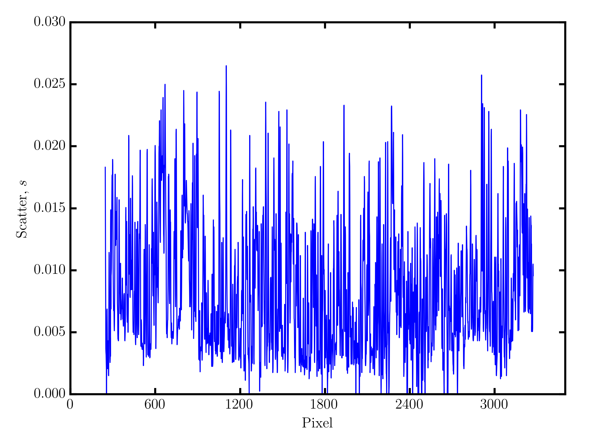
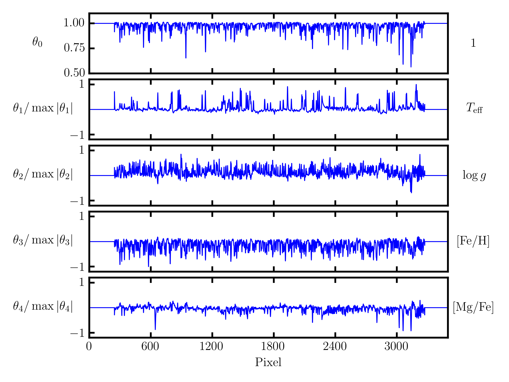
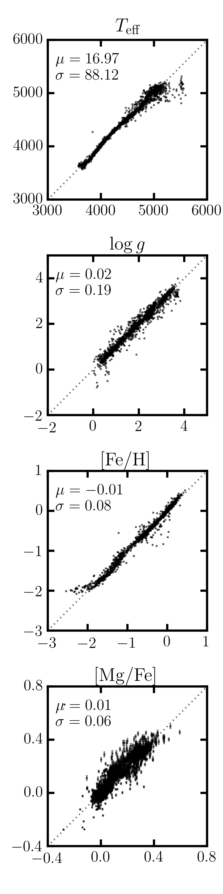

.. _guide:

Getting Started Guide
=====================

Before we get started, you should know that the following ingredients are required to run The Cannon: 

 - a *training set* of stars with known labels (e.g., stellar parameters and chemical abundances),
 - pseudo-continuum-normalized spectra of stars in the training set, with all spectra sampled onto the same wavelength points,
 - some *test set* spectra that you want to derive labels from, which has been processed the same way as the training set spectra.

In this guide we will provide you with the training set labels and spectra, and the test set spectra. If you want more information about `constructing a training set <tutorials.html#constructing-a-training-set>`_ or `continuum-normalizing your spectra <tutorials.html#continuum-normalization>`_, see the linked tutorials. 
 
.. note:: We use `Travis continuous integration <https://travis-ci.org/andycasey/AnniesLasso>`_ to test every change to The Cannon in Python versions 2.7, 3.5, and 3.6. The code examples here should work in any of these Python versions. 

In this guide we will train a model using `APOGEE DR14 <http://www.sdss.org/dr14/irspec/>`_ spectra and `ASPCAP <http://www.sdss.org/dr14/irspec/parameters/>`_ labels to derive effective temperature :math:`T_{\rm eff}`, surface gravity :math:`\log{g}`, and two chemical abundance ratios (:math:`[{\rm Fe}/{\rm H}]`, and :math:`[{\rm Mg}/{\rm Fe}]`.  These spectra have been pseudo-continuum-normalized using a sum of sine and cosine functions (which is a different process `ASPCAP <http://www.sdss.org/dr14/irspec/parameters/>`_ uses for normalization), and individual visits have been stacked.

Here we won't use any `regularization <tutorials.html#regularization>`_ or `wavelength censoring <tutorials.html#censoring>`_, but these can be applied at the end, and the ``CannonModel`` object can be retrained to make use of regularization and/or censoring by using the ``.train()`` function.

Downloading the data
--------------------

You can download the required data for this guide using the following command:

::

    wget zenodo-link #TODO  

Creating a model
----------------

After you have `installed The Cannon <install>`_, you can use the following Python code to construct a ``CannonModel`` object:

.. code-block:: python
    :linenos:

    from astropy.table import Table
    from six.moves import cPickle as pickle
    from sys import version_info

    import thecannon as tc

    # Load the training set labels.
    training_set_labels = Table.read("apogee-dr14-giants.fits")

    # Load the training set spectra.
    pkl_kwds = dict(encoding="latin-1") if version_info[0] >= 3 else {}
    with open("apogee-dr14-giants-flux-ivar.pkl", "rb") as fp:
        training_set_flux, training_set_ivar = pickle.load(fp, **pkl_kwds)

    # Specify the labels that we will use to construct this model.
    label_names = ("TEFF", "LOGG", "FE_H", "MG_FE")

    # Construct a CannonModel object using a quadratic (O=2) polynomial vectorizer.
    model = tc.CannonModel(
        training_set_labels, training_set_flux, training_set_ivar,
        vectorizer=tc.vectorizer.PolynomialVectorizer(label_names, 2))

Let's check the model configuration:

.. code-block:: python

    >>> print(model)
    <thecannon.model.CannonModel of 4 labels with a training set of 1624 stars each with 8575 pixels>

    >>> print(model.vectorizer.human_readable_label_vector)
    1 + TEFF + LOGG + FE_H + MG_FE + TEFF^2 + LOGG*TEFF + FE_H*TEFF + MG_FE*TEFF + LOGG^2 + FE_H*LOGG + LOGG*MG_FE + FE_H^2 + FE_H*MG_FE + MG_FE^2

    # This model has no regularization.
    >>> print(model.regularization)
    None

    # This model includes no censoring.
    >>> print(model.censors)
    {}

The training step
-----------------

The model configuration matches what we expected, so let's train the model and make it useful:

.. code-block:: python

    >>> theta, s2, metadata = model.train(threads=1)
    2017-03-07 15:35:39,429 [INFO] Training 4-label CannonModel with 1624 stars and 8575 pixels/star
    [====================================================================================================] 100% (30s) 

The model should take less than a minute to train on a single core. Pixels can be trained independently, so you can parallelize the training step to as many threads as you want using the ``threads`` keyword argument. 

The ``.train()`` function returns the :math:`\theta` coefficients, the noise residuals :math:`s^2`, and metadata associated with the training of each pixel. The :math:`\theta` coefficients and scatter terms :math:`s^2` are also accessible through the ``.theta`` and ``.s2`` attributes, respectively.

.. code-block:: python
    :linenos:

    # Show the noise residuals, but skip the first 300 pixels because
    # they are at the edge of the chip and contain no information.
    # (Note that the last few pixels have s2 = inf because they also
    # contain no information)
    model.s2[300:]
    >>> array([  2.30660156e-04,   1.38062500e-04,   9.62851563e-05, ...,
                            inf,              inf,              inf])

    fig_scatter = tc.plot.scatter(model)
    fig_scatter.axes[0].set_xlim(0, 3500)
    fig_scatter.savefig("scatter.png", dpi=300)

The code above will produce the following figure, which is zoomed to the first 3500 pixels.

.. code-block:: python
    :linenos:
   
    model.theta[300:]
    >>> array([[ 0.83280641,  0.07220653,  0.06093662, ..., -0.06230124,
                 0.02992542,  0.01622936],
               [ 0.87702919,  0.06771544,  0.02640131, ..., -0.05761867,
                 0.02520221,  0.0121453 ],
               [ 0.91777263,  0.05795435, -0.00384247, ..., -0.04377245,
                 0.01897458,  0.00580555],
               ..., 
               [ 1.        ,  0.        ,  0.        , ...,  0.        ,
                 0.        ,  0.        ],
               [ 1.        ,  0.        ,  0.        , ...,  0.        ,
                 0.        ,  0.        ],
               [ 1.        ,  0.        ,  0.        , ...,  0.        ,
                 0.        ,  0.        ]])

    fig_theta = tc.plot.theta(model, 
        # Show the first 5 terms in the label vector.
        indices=range(5), xlim=(0, 3500),
        latex_label_names=[
            r"T_{\rm eff}",
            r"\log{g}",
            r"[{\rm Fe}/{\rm H}]",
            r"[{\rm Mg}/{\rm Fe}]",
        ])
    fig_theta.savefig("theta.png", dpi=300)

This code will produce the figure below, showing the coefficients for the first seven terms in the label vector,
including the mean flux term, again for the first 3500 pixels.  Each coefficient has been normalized by the maximum
absolute value in order to show relative scales between different coefficients.  These first seven coefficients
include all linear label terms, which is shown by the corresponding label term on the right hand side of each
axis.
 

The test step
-------------

The trained model can now be used to run the test step against all APOGEE spectra. First, we will run the test step *on the training set spectra* as a sanity check to ensure we can approximately recover the ASPCAP labels.

.. code-block:: python
    :linenos:

    test_labels, cov, metadata = model.test(training_set_flux, training_set_ivar)

    fig_comparison = tc.plot.one_to_one(model, test_labels,
        latex_label_names=[
            r"T_{\rm eff}",
            r"\log{g}",
            r"[{\rm Fe}/{\rm H}]",
            r"[{\rm Mg}/{\rm Fe}]",
        ])
    fig_comparison.savefig("one-to-one.png", dpi=300)   

Saving the model to disk
------------------------

All ``CannonModel`` objects can be written to disk, and read from disk in order to run the test step at a later time. When a model is saved, it can either be saved with or without the training set fluxes and inverse variances. The training set fluxes and inverse variances aren't strictly needed anymore once the model is trained, but they can be useful if you want to re-train the model (e.g., with regularization or censoring), or if you want to run the test step on the spectra used to train the model. 

.. code-block:: python
   :linenos:

    model.write("apogee-dr14-giants.model")
    model.write("apogee-dr14-giants-full.model", include_training_set_spectra=True)

By default the training set spectra are not saved because they can add considerably to the file size. The ``apogee-dr14-giants-full.model`` file size would be smaller given a smaller training set.

.. code-block:: python
 
    >>> ls -lh *.model
    -rw-rw-r-- 1 arc arc 214M Mar  6 15:58 apogee-dr14-giants-full.model
    -rw-rw-r-- 1 arc arc 1.1M Mar  6 15:58 apogee-dr14-giants.model

Any saved models can be loaded from disk using the ``.read()`` function:

.. code-block:: python

    >>> new_model = tc.CannonModel.read("apogee-dr14-giants.model")
    >>> new_model.is_trained
    True

